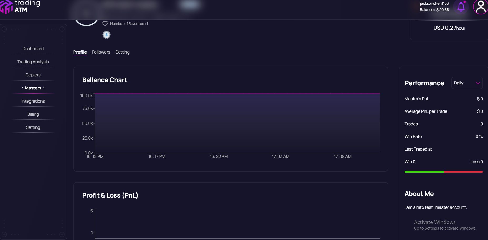
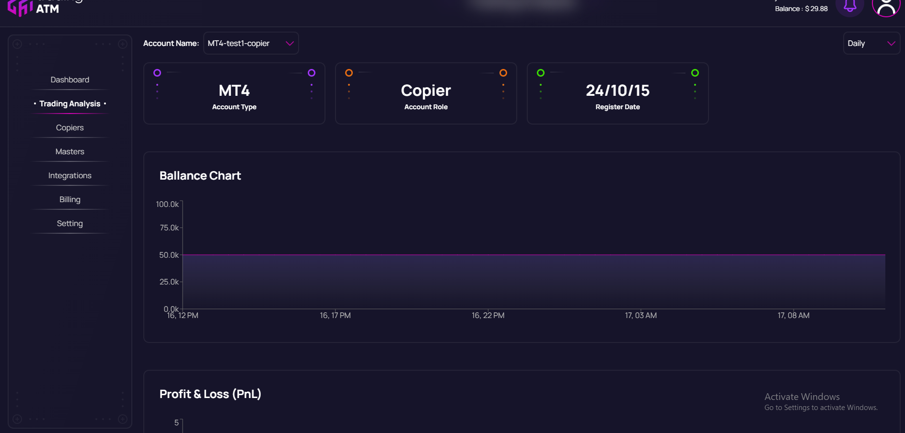

# TradingATM
## Introduction
TradingATM is an innovative social copy trading platform designed to facilitate seamless copy trading across multiple trading platforms, including TradeLocker, MetaTrader 4 (MT4), and MetaTrader 5 (MT5). This Software as a Service (SaaS) platform allows users to register their trading accounts as "masters," enabling the tracking of their trading activities, which are then displayed in both chart and numerical formats. Other users can view the performance of all master accounts and choose to copy trades from profitable masters by registering their accounts as "copiers." The platform also provides tools for copiers to monitor their account performance effectively.

## Images
Images to showcase the site.

<table>
  <tr>
    <td align = "center">
      
    </td>
  </tr>
  <tr>
    <td align = "center">
      
    </td>
  </tr>

  <tr>
    <td align = "center">
      
    </td>
  </tr>

</table>

## Workflow Video
To understand how TradingATM works, watch our workflow video:

- **Link to Video File**:
https://drive.google.com/drive/folders/1VDuP3ejbAHmBvuZ_zBW27W0eJ6SKFJEF?usp=drive_link

## Technical Implementation
### Homepage
- Built on WordPress, providing a user-friendly interface for information dissemination and user engagement.

### Dashboard Frontend
- Developed using React, ensuring a dynamic and responsive user experience for both master and copier accounts.

### Main Backend
- Leveraging Node.js for efficient server-side operations, handling user registrations, transactions, and data management.

### MetaTrader API Backend
- Implemented using ASP.NET, facilitating robust integration with MT4 and MT5 for real-time trade execution and account management.

### Payment Integration
To enhance user accessibility, TradingATM incorporates Cryptomus, a third-party cryptocurrency payment platform. This integration allows users to make payments using various cryptocurrencies, aligning with the growing trend of digital asset utilization in financial transactions.

## Role and Responsibilities
In this project, my primary responsibilities include backend development, where I focus on creating and maintaining the server-side functionalities that support the core operations of the platform. Additionally, I actively participate in the frontend dashboard development to ensure a cohesive user experience across the application.

## Conclusion
TradingATM represents a significant advancement in the realm of copy trading by providing a comprehensive platform that bridges various trading environments. With its focus on user engagement, real-time performance tracking, and cryptocurrency payment options, it positions itself as a leader in the evolving landscape of social trading solutions.

## Live Version Link
https://tradingatmstg.wpenginepowered.com/

## Code Privacy
The code repository is not publicly accessible as the project is currently live and maintained privately.
